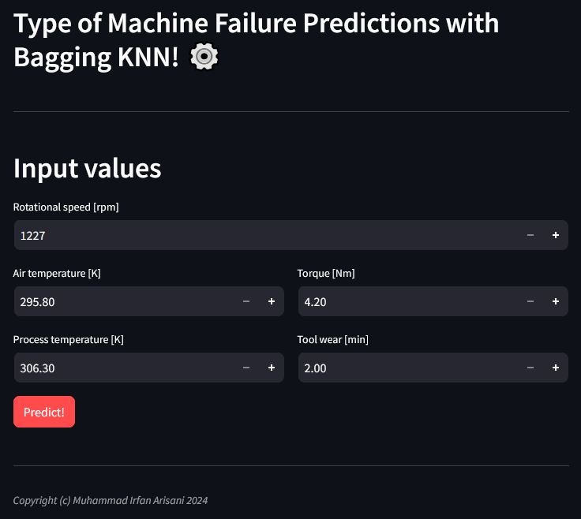
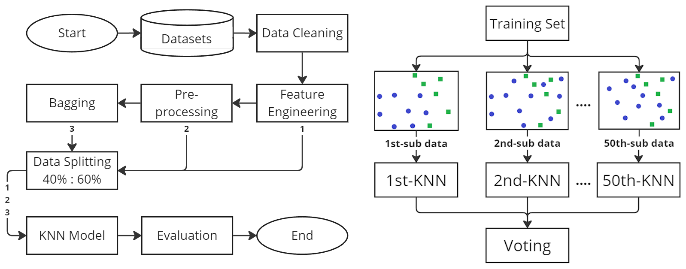
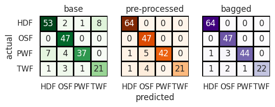
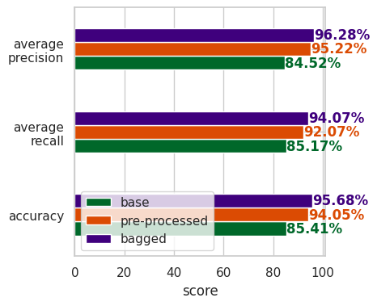

# Bagging KNN Implementation on AI4I Predictive Maintenance Dataset (specific task)
An alternative title of 'Implementasi Bagging KNN pada Dataset Pemeliharaan Prediktif AI4I (tugas khusus)' which focusing on type of machine failure prediction.

## Project Description

This repository was made by the author's team to complete the final project challenge from Fresh Graduate Academy (FGA) and supporting the academic purpose. In this project, we propose a Bagging KNN for machine learning task. To use this project, you may want to install some specific library versions on your local machine.

## Contributor
| Full Name | Affiliation | Email | LinkedIn | Role |
| --- | --- | --- | --- | --- |
| Muhammad Irfan Arisani | Universitas Dian Nuswantoro | 111202012634@mhs.dinus.ac.id | [link](https://www.linkedin.com/in/muhammad-irfan-arisani-224068228/) | Project Leader |
| Muljono | Universitas Dian Nuswantoro | muljono@dsn.dinus.ac.id | [link](https://www.linkedin.com/in/muljono-muljono-2664a1212/) | Supervisor |

## Setup
### Prerequisite Packages (Dependencies)
By the time this project was created, the following installed libraries and their versions will be:
- streamlit == 1.36.0
- joblib == 1.4.2
- scikit-learn == 1.5.0

### Environment
This project has been tested in the following local machine specifications, any of those which better than this should give a better experience.
| Componenets | Name |
| --- | --- |
| CPU | Intel i3-1215U |
| GPU | Integrated UHD Graphics |
| ROM | 1 TB SSD |
| RAM | 8 GB |
| OS | Windows 11 |

## Dataset
In this experiment, we are using AI4I Predictive Maintenance Dataset. The following datasets link can be found in Kaggle and UCI Machine Learning.
- [Kaggle](https://www.kaggle.com/datasets/stephanmatzka/predictive-maintenance-dataset-ai4i-2020)
- [UCI Machine Learning Repository](https://archive.ics.uci.edu/dataset/601/ai4i+2020+predictive+maintenance+dataset)

### Research Methodology and Concept
The following research methodology and concept of bagging KNN will be shown below.

## Results and Discussion
### Model Performance
In this section, the results of base, pre-processed, and bagged KNN will be shown below.

#### 1. Data Splitting
We used the 40:60 data splitting ratio, meaning that 40% for training data and 60% for testing data. The following approach was to achieve a higher quality of prediction. Please refers to the research methodology and concept.

#### 2. Confusion Matrix
The KNN modelling experiment resulting in following confusion matrix result shown below.

#### 3. Metrics
There are three main metrics for this KNN experiment, the accuracy, average precision, and average recall.

The following score comparisons will be shown in the table below:
| model | accuracy | average precision | average recall |
| --- | --- | --- | --- |
| base_knn | 85.41% | 84.52% | 85.17% |
| pre-processed_knn | 94.05% | 95.22% | 92.07% |
| bagged_knn | **95.68%** | **96.28%** | **94.07%** |

### Deployment
There are several steps to use this project:
1. Install the required libraries, you can go to the `Prerequisite Packages (Dependencies)` section above.
2. Clone this repository to your local machine, and locate your path directory to `gws-deployment` folder.
3. Open CMD in that directory, and type `streamlit run app.py` command.

## Supporting Documents
- [Research Paper](https://jurnal.untan.ac.id/index.php/justin/article/view/78503)
- [Online Deployment](https://machine-types-prediction-with-bagging-knn.streamlit.app/)

## License
For academic and non-commercial use only.